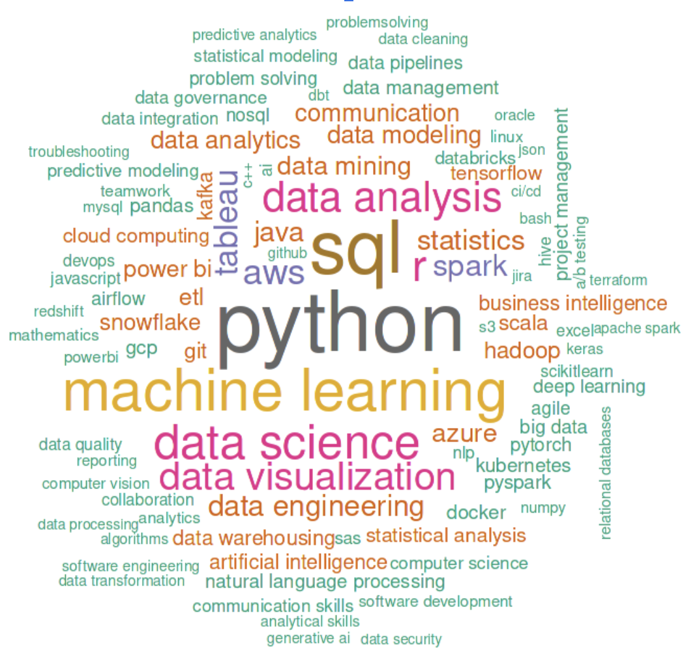

# Job-Postings-Text-Summarization
This project aims to analyze and summarize LinkedIn data science job postings to uncover trends in required skills, software proficiencies, and job descriptions. The goal is to provide a concise and comprehensive understanding of employer expectations to help job seekers better align their profiles with industry demands.

## Table of Contents
- [Project Background](#project-background)
- [Dataset Overview](#dataset-overview)
- [Analysis Components and Results](#analysis-components-and-results)
- [Contributors](#contributors)

## Project Background
The demand for data science professionals is rapidly increasing, and LinkedIn serves as a major platform for connecting job seekers with opportunities in this domain. However, the vast amount of job postings makes it challenging to extract actionable insights.

Thus, to provide the best simplicity and easiness for job-seekers, we tried several models including open-source LLM or locally trained models to perform the task of summarization. By comparing different model performance based on selected metrics and also their trade-offs, we may choose to apply them in diffeent contexts if possible.

## [Dataset Overview](https://www.kaggle.com/datasets/asaniczka/data-scientist-linkedin-job-postings)
In today's dynamic job market, understanding the skills and qualifications that employers are seeking is paramount for job seekers, recruiters, and policymakers alike. With the exponential growth of job postings across various industries, extracting meaningful insights from this vast amount of data can be challenging. To address this, we leverage different technique to distill key trends and patterns from job posting datasets. This dataset includes columns such as job titles, job locations, company names, skills required, salary, job level, and job summary etc. 

## Analysis Components and Results
1. [Exploratory Data Analysis](eda.ipynb)
- Main Findings:
    - Top 10 Most Common Job Skills:
    - Top 10 On-Demand Job Titles: Senior Data Scientist, Data Scientist, Data Engineer, Data Analyst, Senior Data Engineer, …
    - Job Levels: Senior >> Associate
    - Key Skill sets:
    

2. [Modeling](model.ipynb)
- Data Cleaning & Preprocessing:
    - Remove special characters & digits
    - Lowercase
    - Tokenization
    - Retain data-related keywords (skills)
    - Remove stop words
- Models: 
    - facebook/bart-large-cnn (served as baseline)
        - ROUGE scores in the range of 10-20%
        - Relevancy scores - Cosine Similarity
        - [results example](zero-shot-summaries.txt)
    - OpenAI model

See more details in the [report]().

## Contributors
- Xiyi Lin
- Yi (Grace) Xie
- Sydney Li
- Oliver Zhou
